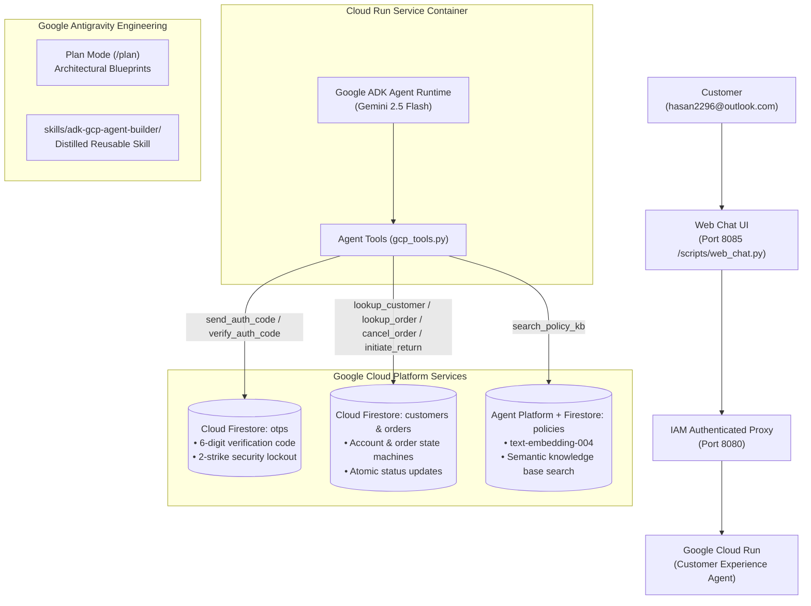
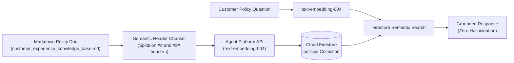

# Customer Experience Agent — GCP Native Enterprise AI Agent

An enterprise AI customer experience agent built natively on **Google Cloud Platform (Cloud Run, Cloud Firestore, Agent Platform)** and orchestrated with **Google ADK (Agent Development Kit)**, engineered end-to-end using **Google Antigravity**.

---

## Architecture Overview



---

## Core GCP Services & Tool Mapping

Every tool invoked by the agent connects directly to managed Google Cloud infrastructure with hard code-level validations:

| Tool | Backing GCP Service | What It Does | Guardrail / Safety Hook |
|---|---|---|---|
| `send_auth_code` | **Cloud Firestore** (`otps`) | Generates a secure 6-digit OTP code with a 10-minute expiry window. | Resets previous attempt counters and invalidates expired codes. |
| `verify_auth_code` | **Cloud Firestore** (`otps`) | Verifies the code entered by the customer. | **2-Strike Lockout**: Code tracks failed attempts in Firestore. If the user fails twice, the account is locked and access is denied. |
| `lookup_customer` | **Cloud Firestore** (`customers`) | Retrieves customer profile, address, and loyalty status. | **Strict Ownership**: Requires a verified email in the session; cannot query any other customer's account. |
| `lookup_order` | **Cloud Firestore** (`orders`) | Retrieves order items, shipping status, carrier tracking, and delivery dates. | **Tenant Isolation**: Only returns orders that belong to the verified customer. |
| `cancel_order` | **Cloud Firestore** (`orders`) | Atomically cancels an active order in Firestore. | **Pre-Shipment Gate**: Can only cancel orders with status `"Processing"`. If already shipped, the tool rejects cancellation and routes to returns. |
| `initiate_return` | **Cloud Firestore** (`orders`) | Initiates a return and generates return instructions / QR code. | **Eligibility Gate**: Enforces the 30-day return window based on the order's delivery date. |
| `search_policy_kb` | **Agent Platform** + **Cloud Firestore** (`policies`) | Semantic search over company policies (returns, shipping, cancellations). | **Grounded RAG**: Uses `text-embedding-004` to find relevant policy sections, ensuring accurate answers without hallucinations. |
| `escalate_to_human` | **Logging & Handoff** | Packages conversation history for human customer support. | Triggered when a request falls outside automated SOP guidelines. |

---

## RAG Architecture: How `search_policy_kb` Works

To ensure all answers regarding shipping times, return policies, and warranties are completely grounded and hallucination-free, `search_policy_kb` uses a purpose-built **Retrieval-Augmented Generation (RAG)** pipeline:



1. **Knowledge Base Ingestion**:
   - Company policies are maintained in [`data/customer_experience_knowledge_base.md`](data/customer_experience_knowledge_base.md).
   - An ingestion script (`customer_agent/scripts/index_knowledge_base.py`) parses the document by semantic section headers (`##` and `###`), preserving contextual hierarchy.
2. **Semantic Embeddings with Agent Platform**:
   - Each section is passed to Google's **Agent Platform** using the **`text-embedding-004`** model to generate dense semantic embeddings.
   - The embeddings and section text are saved into the Cloud Firestore **`policies`** collection.
3. **Runtime Policy Retrieval**:
   - When a user asks a question (e.g., *"What is your return window?"* or *"Can I cancel after my order has shipped?"*), `search_policy_kb` embeds the question on the fly and retrieves the most relevant policy sections from Firestore.
   - The agent uses those retrieved excerpts as grounded source material to answer the user accurately.

---

## Deterministic Guardrails & Safety Hooks

To ensure enterprise reliability, the agent combines **code-level deterministic guardrails** with **instruction-level behavioral hooks**:

### Code-Level Guardrails (Hard Rules Enforced in Python)
- **2-Strike Lockout**: Enforced directly in Firestore logic so brute-force code guessing cannot succeed, regardless of prompt phrasing.
- **Pre-Shipment Order Cancellation**: The `cancel_order` function explicitly checks order status:
  ```python
  if order.get("status") != "Processing":
      return {"error": f"Cannot cancel order with status '{order.get('status')}'. Orders can only be cancelled while Processing."}
  ```
- **Return Eligibility Verification**: Verifies that the order's delivery timestamp is within 30 days before initiating a return.
- **Identity Gating**: Sensitive customer tools require `verified_email` to match the customer record, preventing cross-account access.

### Instruction-Level Guardrails (Behavioral Rules)
- **Hostile Customer De-escalation**: The agent stays calm and empathetic, acknowledges frustration, and never mirrors abusive language.
- **Accurate Refund Timing**: The agent never claims a refund is complete immediately; it clarifies that refunds are processed within 5–7 business days after the warehouse receives the item.
- **Out-of-Scope & Injection Defenses**: The agent politely declines prompt injections, system prompt extraction, or general requests unrelated to Customer Experience.

---

## Built with Google Antigravity & the Reusable Skill

This agent was engineered end-to-end using **Google Antigravity**:

1. **Plan Mode (`/plan`)**:
   - Architectural decisions, datastore models, RAG design, and zero-downtime deployment strategies were governed by iterative, reviewed implementation plans.
2. **The Reusable Skill (`skills/adk-gcp-agent-builder/`)**:
   - The entire production setup has been packaged into a reusable skill located directly in this repo: [**`skills/adk-gcp-agent-builder/`**](skills/adk-gcp-agent-builder/).
   - Includes production templates for the Firestore client, RAG indexing scripts, web chat UI, and Cloud Run deployment runbooks so teams can scaffold new GCP-native agents in minutes.

---

## Quickstart Guide

### 1. Prerequisites
- Python 3.11+
- Google Cloud SDK (`gcloud`) authenticated to your GCP project:
  ```bash
  gcloud auth application-default login
  gcloud config set project YOUR_PROJECT_ID
  ```

### 2. Environment Setup
```bash
cd customer_agent
python3 -m venv .venv
source .venv/bin/activate
pip install -e .
```

### 3. Seed Cloud Firestore & Index the Policy Knowledge Base
```bash
# Seed customers, orders, and initialize collections in Cloud Firestore
python3 customer_agent/scripts/seed_firestore.py

# Index markdown policies into Firestore using Agent Platform embeddings
python3 customer_agent/scripts/index_knowledge_base.py
```

### 4. Run Automated Parity & Integration Tests
```bash
pytest customer_agent/tests/integration/test_firestore_parity.py -v
pytest customer_agent/tests/integration/test_e2e_simulation.py -v
```

### 5. Launch the Web Chat UI
```bash
python3 customer_agent/scripts/web_chat.py
```
Open **`http://127.0.0.1:8085`** in your browser to interact with the live agent.

---

## Repository Structure

```
customer-experience-agent/
├── customer_agent/               # Agent Core Application
│   ├── app/
│   │   ├── agent.py              # ADK Agent definition & prompt instructions
│   │   ├── gcp_tools.py          # Tools mapped to Firestore & Agent Platform
│   │   ├── gcp_client.py         # Cloud Firestore & Agent Platform manager
│   │   └── tools.py              # Tool module exports
│   ├── scripts/
│   │   ├── web_chat.py           # Real-time web chat UI
│   │   ├── seed_firestore.py     # Firestore datastore seeder
│   │   ├── index_knowledge_base.py # RAG embedding and indexing pipeline
│   │   └── chat_live.py          # Interactive terminal chat
│   ├── tests/
│   │   └── integration/          # Integration & state machine verification suites
│   ├── Dockerfile                # Production container specification for Cloud Run
│   └── agents-cli-manifest.yaml  # ADK deployment manifest
├── skills/
│   └── adk-gcp-agent-builder/    # Antigravity Reusable Skill & Templates
├── data/
│   └── customer_experience_knowledge_base.md # Source policy corpus for RAG
└── docs/                         # Architecture documentation and SOPs
```
