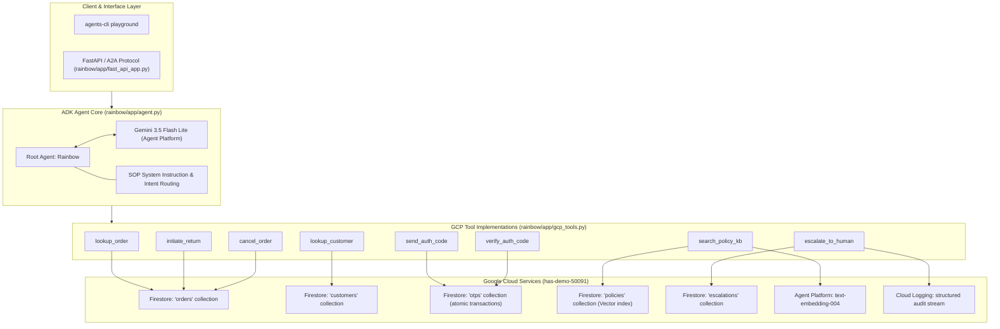

# Target Design Specification: GCP-Native Firestore Architecture

## 1. Overview & Architecture Goals

This document specifies the target architecture, data models, and service interfaces for the **Customer Experience Agent (`Rainbow`)** on Google Cloud Platform. 

It satisfies the **Phase 3 (Target Design & Spec)** deliverable of the [OpenAI Code Modernization Framework](https://developers.openai.com/cookbook/examples/codex/code_modernization).

### Core Architectural Principles
1. **100% GCP Native**: Zero reliance on 3rd-party SaaS (Stytch) or desktop OAuth (Google Sheets). All components authenticate via Google Cloud Application Default Credentials (ADC) or service accounts in project **`has-demo-50091`** (region `us-central1`).
2. **Unified Data & Vector Store**: Cloud Firestore in Native mode serves as both the relational-style transactional store (`customers`, `orders`, `otps`, `escalations`) and the semantic vector store (`policies`).
3. **Deterministic Safety Enforcement**: All security, ownership, return eligibility, and lockout checks are enforced deterministically in Python and Firestore atomic transactions before mutations occur.
4. **Environment Portability**: All paths, projects, and collection names are configurable via environment variables (`.env`), with built-in support for the local **Firestore Emulator** (`FIRESTORE_EMULATOR_HOST`) and mock fallbacks for testing.

---

## 2. Target Component Architecture



---

## 3. Firestore Schema & Transaction Specifications

### 3.1 `customers` Collection
- **Path**: `customers/{customer_id}`
- **Document Structure**:
```json
{
  "customer_id": "CUST-001",
  "name": "Hasan Rahman",
  "email": "hasan2296@outlook.com",
  "phone": "+1-503-555-0142",
  "home_address": "482 Elm Street, Portland, OR 97205",
  "created_at": "2026-01-15T09:00:00Z"
}
```
- **Lookup Query**:
  `db.collection("customers").where("email", "==", verified_email.strip().lower()).limit(1).get()`

---

### 3.2 `orders` Collection
- **Path**: `orders/{order_number}`
- **Document Structure**:
```json
{
  "order_number": "BK-10001",
  "order_date": "2026-09-01",
  "customer_id": "CUST-001",
  "customer_name": "Hasan Rahman",
  "customer_email": "hasan2296@outlook.com",
  "book_ordered": "The Midnight Library",
  "category": "Fiction",
  "address_shipped_to": "482 Elm Street, Portland, OR 97205",
  "shipping_status": "Delivered",
  "carrier": "USPS",
  "tracking_number": "9400111899223192000001",
  "return_eligible_30_day": true,
  "return_status": "None",
  "updated_at": "2026-09-05T14:30:00Z"
}
```

#### Mutation 1: `initiate_return` Atomic Transaction
```python
@firestore.transactional
def _transact_return(transaction, order_ref, verified_email, reason):
    snapshot = order_ref.get(transaction=transaction)
    if not snapshot.exists:
        return "NOT_FOUND"
    data = snapshot.to_dict()
    if data["customer_email"].strip().lower() != verified_email.strip().lower():
        return "UNAUTHORIZED"
    if data.get("category", "") in ["Clearance", "Rare/Collectible"]:
        return "FINAL_SALE"
    order_date = datetime.strptime(data["order_date"], "%Y-%m-%d").date()
    if (date.today() - order_date).days > 30:
        return "PAST_WINDOW"
    if data.get("return_status") == "Requested":
        return "ALREADY_REQUESTED"
    
    transaction.update(order_ref, {
        "return_status": "Requested",
        "return_reason": reason,
        "updated_at": firestore.SERVER_TIMESTAMP,
    })
    return "SUCCESS"
```

#### Mutation 2: `cancel_order` Atomic Transaction
```python
@firestore.transactional
def _transact_cancellation(transaction, order_ref, verified_email, reason):
    snapshot = order_ref.get(transaction=transaction)
    if not snapshot.exists:
        return "NOT_FOUND"
    data = snapshot.to_dict()
    if data["customer_email"].strip().lower() != verified_email.strip().lower():
        return "UNAUTHORIZED"
    if data.get("shipping_status") != "Processing":
        return "TOO_LATE"
    
    transaction.update(order_ref, {
        "shipping_status": "Cancelled",
        "cancellation_reason": reason,
        "updated_at": firestore.SERVER_TIMESTAMP,
    })
    return "SUCCESS"
```

---

### 3.3 `otps` Collection (Atomic Lockout Engine)
- **Path**: `otps/{email}`
- **Document Structure**:
```json
{
  "email": "hasan2296@outlook.com",
  "code": "842910",
  "expires_at": "2026-09-29T12:15:00Z",
  "attempts": 0,
  "locked": false,
  "verified": false,
  "created_at": "2026-09-29T12:05:00Z",
  "updated_at": "2026-09-29T12:05:00Z"
}
```

#### Mutation: `verify_auth_code` Atomic Lockout Transaction
```python
@firestore.transactional
def _transact_verify_otp(transaction, otp_ref, user_code):
    snapshot = otp_ref.get(transaction=transaction)
    if not snapshot.exists:
        return "NO_PENDING_CODE"
    data = snapshot.to_dict()
    if data.get("locked"):
        return "LOCKED"
    if datetime.now(timezone.utc) > data["expires_at"]:
        return "EXPIRED"
    
    if data["code"] != user_code.strip():
        new_attempts = data.get("attempts", 0) + 1
        is_locked = new_attempts >= 2
        transaction.update(otp_ref, {
            "attempts": new_attempts,
            "locked": is_locked,
            "updated_at": firestore.SERVER_TIMESTAMP,
        })
        return "LOCKED" if is_locked else "INVALID"
    
    transaction.update(otp_ref, {
        "verified": True,
        "attempts": 0,
        "updated_at": firestore.SERVER_TIMESTAMP,
    })
    return "SUCCESS"
```

---

### 3.4 `policies` Collection (Firestore Vector Search)
- **Path**: `policies/{slug}`
- **Document Structure**:
```json
{
  "slug": "return-and-refund-policy",
  "title": "Return & Refund Policy",
  "section": "Returns",
  "content": "## Return & Refund Policy\n\n- Return window: 30 days from the delivery date...",
  "embedding": "Vector([0.0124, -0.0481, ..., 0.0319])" // 768 dimensions
}
```

#### Vector Search Query Mechanics:
```python
from google.cloud.firestore_v1.vector import Vector
from google.cloud.firestore_v1.base_vector_query import DistanceMeasure

def search_policy_kb(query: str, limit: int = 2) -> str:
    query_emb = _get_embedding(query)  # calls Agent Platform text-embedding-004
    col = db.collection("policies")
    vector_query = col.find_nearest(
        vector_field="embedding",
        query_vector=Vector(query_emb),
        distance_measure=DistanceMeasure.COSINE,
        limit=limit,
    )
    docs = [d.to_dict()["content"] for d in vector_query.get()]
    return "\n\n---\n\n".join(docs) if docs else "No relevant policy found."
```

---

### 3.5 `escalations` Collection & Cloud Logging
- **Path**: `escalations/{escalation_id}`
```json
{
  "escalation_id": "esc_1790695447_01",
  "timestamp": "2026-09-29T12:06:12Z",
  "customer_email": "hasan2296@outlook.com",
  "order_number": "BK-10001",
  "reason": "NON_RECEIPT_DELIVERED",
  "summary": "Customer explicitly stated package was not received although carrier reported Delivered.",
  "status": "Pending"
}
```
In parallel with the Firestore document write, a structured JSON entry is emitted to **Cloud Logging**:
```python
logger.log_struct(
    {
        "event": "SUPPORT_ESCALATION",
        "customer_email": customer_email,
        "reason": reason,
        "summary": summary,
        "timestamp": datetime.now(timezone.utc).isoformat(),
    },
    severity="WARNING",
)
```

---

## 4. Module Layout & Environment Configuration

### File Layout
```
rainbow/
├── app/
│   ├── gcp_tools.py           # All 8 modernized GCP tools
│   ├── gcp_client.py          # Firestore & Agent Platform client wrapper with emulator/mock fallback
│   ├── agent.py               # Root ADK agent wiring gcp_tools
│   └── fast_api_app.py        # Cloud Run entrypoint
├── scripts/
│   ├── seed_firestore.py      # Populates customers & orders into has-demo-50091
│   └── index_knowledge_base.py# Chunks KB & generates embeddings into policies collection
└── tests/
    └── integration/
        └── test_firestore_parity.py # Parity validation suite
```

### Environment Variables (`.env`)
```bash
GOOGLE_CLOUD_PROJECT=has-demo-50091
GOOGLE_CLOUD_LOCATION=us-central1
FIRESTORE_DATABASE=(default)
# Optional for local offline testing:
# FIRESTORE_EMULATOR_HOST=localhost:8080
```
