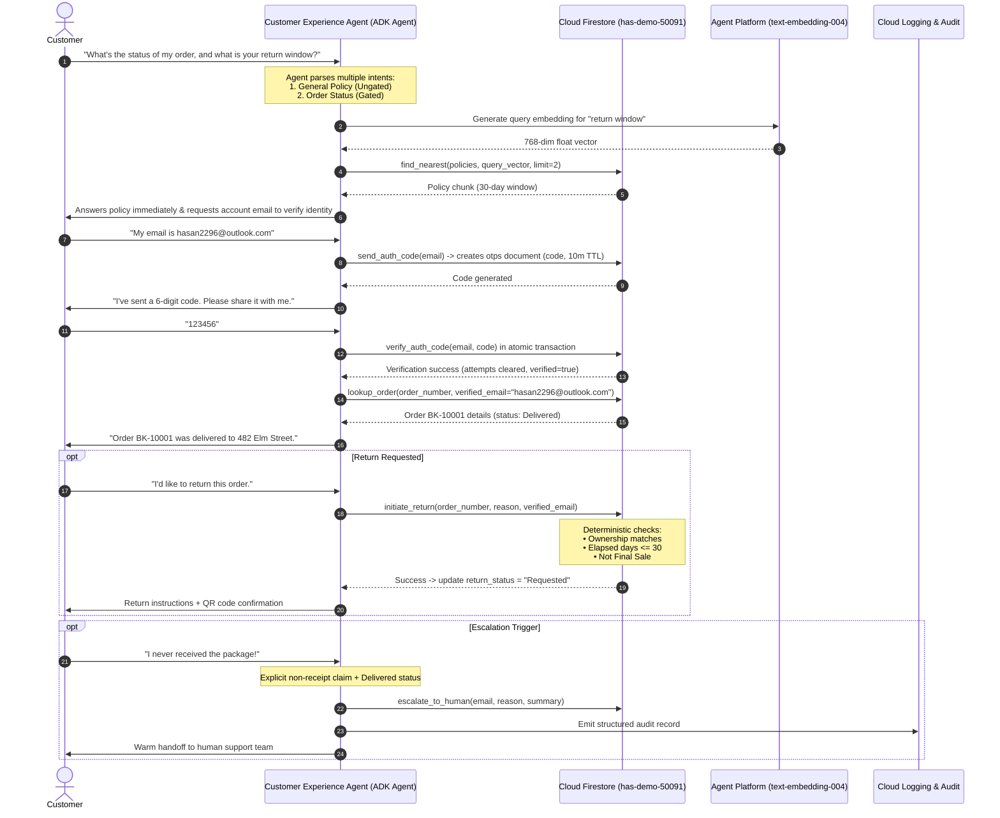

# System Overview & Technical Inventory: Customer Experience Agent

## 1. Executive Summary & Purpose

This document captures the end-to-end baseline anatomy of the **Customer Experience Agent **, formalizing the **Phase 2 (Inventory & Discovery)** deliverable of the [OpenAI Code Modernization Framework](https://developers.openai.com/cookbook/examples/codex/code_modernization).

It details how the existing demo functions today—its backing systems, data flows, business rules, and schemas—and provides the definitive baseline for migrating from prototype components (Google Sheets, Stytch, local ChromaDB) to an enterprise **100% GCP-Native Firestore Architecture** in project **`has-demo-50091`**.

---

## 2. System Inventory

### Core Modules & Responsibilities

| Component | Path | Language / Tech | Responsibilities | Current Backing System | Target GCP-Native System |
| :--- | :--- | :--- | :--- | :--- | :--- |
| **Agent Core** | `customer_agent/app/agent.py` | Python (Google ADK) | Intent routing, prompt instructions, tool wiring | Agent Platform Gemini (`gemini-3.5-flash-lite`) | Agent Platform Gemini (Preserved) |
| **Tool Suite** | `customer_agent/app/tools.py` | Python | 8 business tools for orders, returns, auth, RAG | Sheets API, Stytch SDK, ChromaDB | Cloud Firestore SDK, Vertex Embeddings |
| **FastAPI / A2A App** | `customer_agent/app/fast_api_app.py` | Python (FastAPI) | HTTP API & Agent-to-Agent protocol server | Local process (`uvicorn`) | Cloud Run container |
| **RAG Indexer** | `rag/build_index.py` | Python | Chunker & vector database generator | Local ChromaDB (`sqlite3`) | Firestore Vector Search (`policies` col) |
| **RAG Query** | `rag/query.py` | Python | Standalone vector similarity query | Local ChromaDB (`sqlite3`) | Firestore `find_nearest` with `text-embedding-004` |
| **OAuth Scripts** | `customer_agent/scripts/authorize_sheets.py` | Python | One-time desktop Google OAuth consent | Interactive browser consent flow | None (Replaced by Cloud IAM / ADC) |
| **SOP Specification** | `docs/SOP.md` | Markdown | Human support agent decision tree | Human manual | Canonical rulebook for agent prompts |
| **Knowledge Base** | `data/customer_experience_knowledge_base.md` | Markdown | Source policies (shipping, returns, FAQ) | Raw Markdown text | Chunked & vectorized in Firestore |

---

## 3. End-to-End Data Flow & Sequence Diagram

---

## 4. Data Schemas: Legacy Sheets vs. Cloud Firestore

### `customers` Collection
Replaces the `Customers` tab in Google Sheets.
- **Document ID**: `customer_id` (e.g., `CUST-001`)

| Field Name | Type | Description | Indexing |
| :--- | :--- | :--- | :--- |
| `customer_id` | `string` | Unique customer identifier | Document Key |
| `name` | `string` | Customer full name | None |
| `email` | `string` | Verified account email address | **Single Field Index** (query lookup) |
| `phone` | `string` | Customer contact number | None |
| `home_address` | `string` | Primary delivery address | None |

---

### `orders` Collection
Replaces the `Orders` tab in Google Sheets.
- **Document ID**: `order_number` (e.g., `BK-10001`)

| Field Name | Type | Description | Indexing |
| :--- | :--- | :--- | :--- |
| `order_number` | `string` | Unique order identifier | Document Key |
| `order_date` | `string` | Date order was placed (`YYYY-MM-DD`) | For 30-day window calculation |
| `customer_id` | `string` | Reference to customer document | Filter query |
| `customer_name` | `string` | Customer name at time of order | None |
| `customer_email` | `string` | Email associated with order | **Single Field Index** (ownership verification) |
| `book_ordered` | `string` | Title(s) of purchased items | None |
| `category` | `string` | Book category (e.g., `Fiction`, `Rare/Collectible`, `Clearance`) | Final-sale check |
| `address_shipped_to` | `string` | Delivery destination | None |
| `shipping_status` | `string` | Status: `Processing`, `Shipped`, `Out for Delivery`, `Delivered`, `Delayed`, `Cancelled` | Cancellation eligibility check |
| `carrier` | `string` | Delivery carrier (`USPS`, `UPS`, `FedEx`) | Order tracking details |
| `tracking_number` | `string` | Tracking number | Order tracking details |
| `return_eligible_30_day`| `boolean`| Calculated eligibility flag | Overridden by date check in code |
| `return_status` | `string` | `None`, `Requested`, `Approved`, `Completed` | Prevents duplicate returns |
| `updated_at` | `timestamp`| Last mutation timestamp | Audit |

---

### `otps` Collection (Firestore-Backed OTP)
Replaces Stytch Email OTP API.
- **Document ID**: `email` (e.g., `hasan2296@outlook.com`)

| Field Name | Type | Description | Guardrail / Rule |
| :--- | :--- | :--- | :--- |
| `email` | `string` | Target account email | Document Key |
| `code` | `string` | 6-digit random verification code | Expires after 10 minutes |
| `expires_at` | `timestamp` | UTC expiration time | Rejected if `now > expires_at` |
| `attempts` | `integer` | Consecutive failed verification attempts | Hard lockout when `attempts >= 2` |
| `locked` | `boolean` | Lockout state | If `true`, requires escalation to human |
| `verified` | `boolean` | Verification success status | Grants access to order/account tools |
| `updated_at` | `timestamp` | Timestamp of last interaction | Session tracking |

---

### `policies` Collection (Firestore Vector Search)
Replaces local SQLite ChromaDB.
- **Document ID**: Auto-slug (e.g., `shipping-policy-domestic`)

| Field Name | Type | Description |
| :--- | :--- | :--- |
| `title` | `string` | Policy section heading |
| `section` | `string` | Top-level policy category (Shipping, Returns, Payment, FAQ) |
| `content` | `string` | Full Markdown text of the policy section |
| `embedding` | `Vector` | 768-dimensional float embedding (`text-embedding-004`) |

---

### `escalations` Collection
Replaces flat log file `customer_agent/escalations.log`.
- **Document ID**: Auto-generated UUID

| Field Name | Type | Description |
| :--- | :--- | :--- |
| `timestamp` | `timestamp` | Exact UTC timestamp of escalation |
| `customer_email` | `string` | Email of customer (if known) |
| `reason` | `string` | Categorical reason (`OTP_LOCKOUT`, `NON_RECEIPT`, `CUSTOMER_REQUEST`, `OUT_OF_POLICY`) |
| `summary` | `string` | Complete context and conversation summary for the human agent |
| `status` | `string` | Ticket state (`Pending`, `In Review`, `Resolved`) |

---

## 5. Deterministic Code Guardrails vs. Instruction Rules

| Rule | Enforcement Level | Implementation Logic |
| :--- | :--- | :--- |
| **Order Ownership Check** | **Deterministic (Code)** | Tools require `verified_email`. Reject request immediately if `order.customer_email.lower() != verified_email.lower()`. |
| **Account Ownership Check** | **Deterministic (Code)** | `lookup_customer` accepts no email argument; returns only the profile for `verified_email`. |
| **30-Day Return Window** | **Deterministic (Code)** | Computes `(date.today() - order_date).days <= 30` in Python. Overrides any stale flag. |
| **Final-Sale Exclusions** | **Deterministic (Code)** | Orders with category `Clearance` or `Rare/Collectible` reject change-of-mind returns. |
| **OTP 2-Strike Lockout** | **Deterministic (Code & DB)** | Atomically increments `attempts`. Rejects verification and locks account upon second failure. |
| **Cancellation Window** | **Deterministic (Code)** | `cancel_order` only permits cancellation if `shipping_status == "Processing"`. |
| **Delivered-Not-Received** | **Instruction-Level** | System prompt instructs agent to escalate immediately if customer explicitly claims package was not received and status is "Delivered". |
| **Prompt Injection Protection** | **Instruction-Level** | Declines role-override, instruction extraction, or developer mode prompts. |
| **Out-of-Scope Redirects** | **Instruction-Level** | Politely declines non-Customer Experience questions (coding, creative writing, opinions). |
